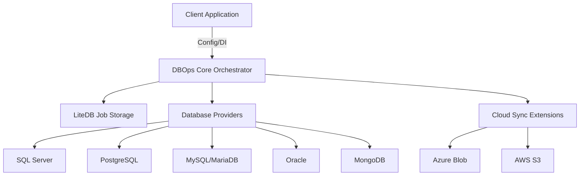

# DataCrud.DBOps: Architecture Specification

## 1. High-Level Architecture

DataCrud.DBOps is a distributed maintenance and backup orchestrator designed for heterogeneous database environments. It follows a **Provider-Based Plugin Architecture**, where a centralized core engine delegates specific database operations to specialized providers while maintaining a unified state via an embedded NoSQL storage layer.

### System Overview

## 2. Component Breakdown

### A. Core Engine (DataCrud.DBOps.Core)
- **MaintenanceManager**: The entry point for all operations. It handles the lifecycle of a maintenance job (Shrink -> Reindex -> Backup -> Sync).
- **Orchestrator**: Manages concurrency and error handling for multi-step workflows.
- **IJobStorage**: An abstraction for local state persistence. Implemented via **LiteDB** for zero-configuration deployments.

### B. Provider Layer
Each provider implements a standard interface while leveraging native database capabilities:
- **Relational**: Uses CLI utilities (like `pg_dump`, `mysqldump`, `expdp`) or SDKs (SMO for SQL Server) for consistent, high-fidelity backups.
- **NoSQL**: Dedicated logic for BSON-compatible backups and compaction.

### C. Middleware & Extensions
- **DataCrud.DBOps.AspNetCore**: Provides modern Dependency Injection extensions (`AddDatabaseOps`) and dashboard middleware.
- **DataCrud.DBOps.AspNet**: Provides OWIN-compatible middleware for legacy .NET Framework 4.8 applications.

## 3. Data Persistence Strategy

The system utilizes an embedded **LiteDB** instance (`dbops_history.db`) to ensure:
- **Resilience**: Jobs can be audited even if the main application crashes.
- **Metrics**: Detailed performance tracking (backup size, compression ratio, upload speed).
- **Audit Logs**: Full history of maintenance events searchable via the dashboard.

## 4. Multi-Targeting Strategy

To ensure maximum reach, the solution leverages multi-targeting:
- **.NET 9.0**: Native support for modern cloud-native apps.
- **.NET Standard 2.1**: Universal compatibility for modern libraries.
- **.NET Framework 4.8**: Vital support for the large ecosystem of legacy enterprise web applications (WebForms/MVC5).

## 5. Security Architecture

DataCrud.DBOps prioritizes security through separation of concerns:
- **Credential Isolation**: Database credentials are provided via secure configuration strings, never persisted in plain text within the job history.
- **Zero-Trust Dashboard**: Optional Integrated Authentication support via `AuthUsername` and `AuthPassword` configuration.
- **Ephemeral Artifacts**: Temporary backup files are generated in restricted system folders and immediately purged after cloud synchronization.

## 6. Popular Frameworks that do this

DataCrud.DBOps fills a niche between simple SQL scripts and enterprise-grade backup suites. Comparable philosophies can be found in:
- **Hangfire**: Focuses on job scheduling, whereas DBOps focuses on the specific database maintenance workload.
- **SQL Backup Master**: A popular Windows utility; DBOps provides a similar feature set but as a developer-first, container-ready library.
- **Redgate SQL Backup**: Enterprise software; DBOps offers a lightweight, cross-platform alternative for multi-engine environments.
